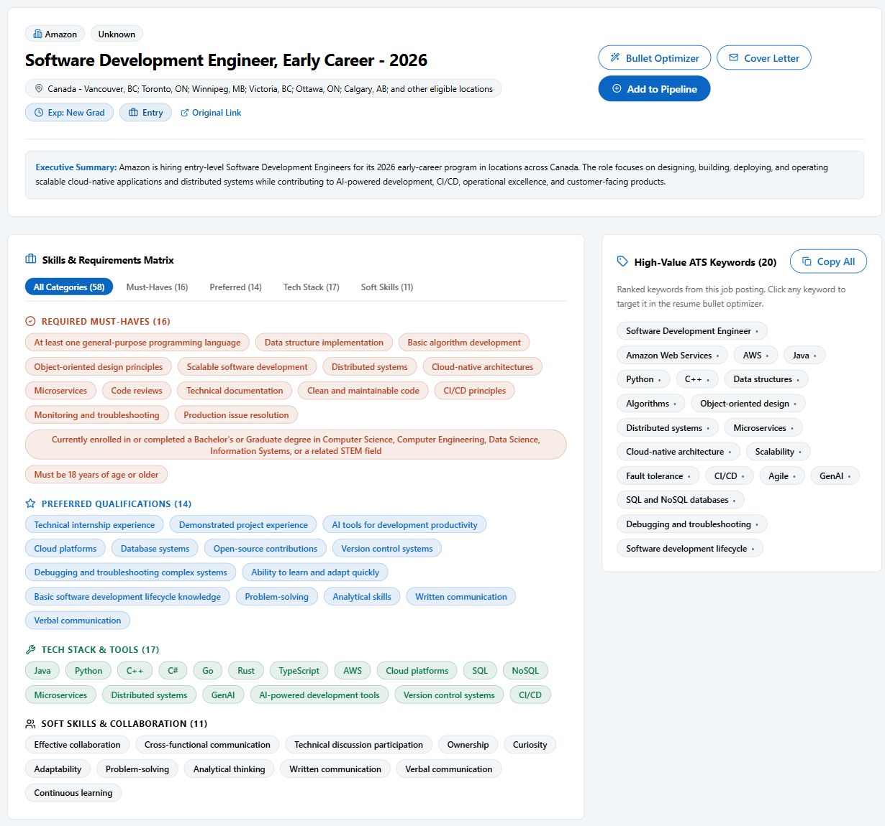
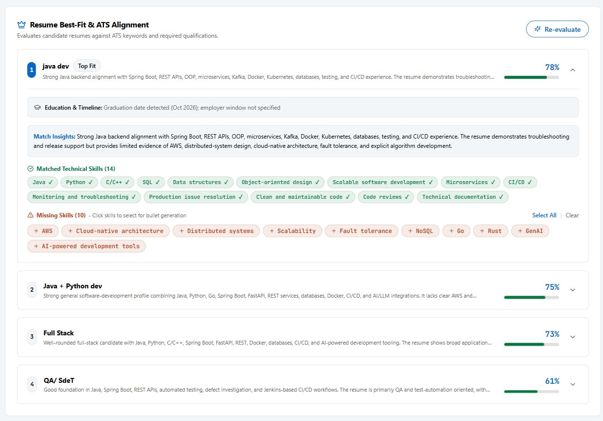

# JobHelperGuru 🚀

**Understand job requirements, tailor your resume, and keep your applications organized.**

[](https://jobhelperguru.onrender.com/)
[](https://github.com/souravC01/JobHelperGuru/actions/workflows/ci.yml)

JobHelperGuru brings job analysis, resume matching, writing assistance, and application tracking into one workspace. Start with a job link or pasted description, compare your resumes against its requirements, draft tailored bullets and outreach, then track the application through to an outcome.

Use the built-in heuristic engine without an AI key, connect your own compatible AI provider, or run a local model with Ollama.

[Explore the live app](https://jobhelperguru.onrender.com/) · [Run locally](#run-locally) · [Development](#development-and-tests) · [Deployment](#deployment)



*Captured from the live application with an Amazon early-career job posting. Screenshots show the job analysis and resume alignment results; scores are application estimates, not employer ATS results.*

## What you can do

| Feature | How it helps |
|---|---|
| **Job analysis** | Extract role, company, location, salary, experience requirements, and work mode from a job URL or pasted description. |
| **Skills and ATS keywords** | Review required and preferred skills, tools, soft skills, and keywords in one place. |
| **Resume vault and matching** | Store multiple resumes, edit their extracted text, rename them, and compare matched and missing skills against a target job. |
| **Resume bullet optimizer** | Generate three alternatives using the WHAT + HOW + RESULT/REASON structure, with assumptions and confirmation prompts. |
| **Cover letters and outreach** | Draft a three-paragraph cover letter, email subject, and short networking note. Download a Word document or use the browser print dialog to save a PDF. |
| **Application tracker** | Manage notes, dates, and follow-ups in table or Kanban views. Move cards with status controls, including an Archived stage. |
| **Excel export** | Download a styled two-sheet workbook with application details, skills, status colors, and supported job hyperlinks. Untrusted cell values are written as text. |
| **Provider profiles** | Manage your own AI connections using server-side encrypted keys and masked profile metadata. |

The application pipeline covers **Wishlist → Applied → Interviewing → Offered → Rejected → Archived**. Follow-up reminders and dashboard totals stay connected to tracker changes.

<details>
<summary><strong>See resume matching in action</strong></summary>

Compare tailored resumes side by side, expand the best match, and review the skills that align with the role or need attention.



</details>

### Resume files and generated drafts

Supported uploads are **PDF, DOCX, TXT, Markdown, and RTF**, up to **10 MB per file**. Convert legacy binary `.doc` files to `.docx` or `.pdf` first. Text extraction also has limits on PDF pages, expanded DOCX size, and extracted text length.

Edits to extracted text are saved for matching and writing assistance; they do not rewrite the original uploaded document. Downloads require authentication. If the original binary is unavailable and saved text exists, the app can provide a clearly identified generated `.docx` copy.

Match scores measure keyword alignment, not an employer's ATS result or a hiring prediction. The [BulletSkill framework](Bulletskill.md) guides draft structure, but generated claims, skills, and metrics still need your review before use.

### AI and offline use

- **Heuristic mode:** Analyze pasted descriptions and compare resume keywords without an external AI key. Template-based writing is more limited than model-generated output.
- **AI providers:** Use any AI provider or LLM of your choice by adding its API key and endpoint link in Settings. You are not limited to a specific agent, model, or provider.

Fetching job URLs requires internet access. Some job boards require login or block extraction; paste the description when a link cannot be read. When using an external model, the job and resume text needed for that action is sent to your selected provider.

## Run locally

The repository's CI and Docker configuration use **Python 3.11** and **Node.js 20**. Install those runtimes and Git before starting.

### 1. Clone and install

```bash
git clone https://github.com/souravC01/JobHelperGuru.git
cd JobHelperGuru
python -m venv .venv
```

Activate the virtual environment:

```powershell
# Windows PowerShell
.\.venv\Scripts\Activate.ps1
```

```bash
# macOS / Linux
source .venv/bin/activate
```

Install backend and frontend dependencies:

```bash
python -m pip install -r requirements.txt
cd frontend
npm ci
cd ..
```

### 2. Configure local mode

Create a `.env` file in the repository root with this minimal configuration:

```dotenv
APP_MODE=local
APP_URL=http://localhost:8000
DATABASE_URL=
R2_ACCOUNT_ID=
R2_ACCESS_KEY_ID=
R2_SECRET_ACCESS_KEY=
R2_ENDPOINT_URL=
```

With cloud settings empty, the app uses SQLite at `data/tracker.db` and files under `data/uploads/`. Local mode generates persistent secrets in `data/.local_secrets.json` when needed. Keep this file with your local data so encrypted settings remain readable across restarts.

The [environment example](.env.example) lists optional integrations. Replace its cloud placeholders only when configuring those services; the minimal configuration above is sufficient for local storage and email/password sign-in. An AI key is optional.

### 3. Build and launch

```bash
cd frontend
npm run build
cd ..
python run.py
```

Open **[localhost:8000](http://localhost:8000)**. The backend serves the built frontend and API together. Rebuild after changing frontend code, or use development mode below.

## Development and tests

For hot reload, start these in separate terminals from the repository root, with the Python virtual environment activated. Set `APP_URL=http://localhost:5173` in `.env` for this workflow.

**Backend:**

```bash
python -m uvicorn backend.main:app --reload --port 8000
```

**Frontend:**

```bash
cd frontend
npm run dev
```

Visit **[localhost:5173](http://localhost:5173)**. Vite proxies `/api` requests to the backend. Interactive API documentation is available at **[localhost:8000/docs](http://localhost:8000/docs)**.

Install development dependencies and run backend tests from the root:

```bash
python -m pip install -r requirements/dev.txt
python -m pytest -q
```

Run frontend checks from `frontend/`:

```bash
npm run test:run
npm run build
```

The test setup uses disposable storage and mocked external services. Regression coverage includes ownership, file access, outbound requests, identity flows, provider profiles, account switching, document handling, and tracker behavior. [GitHub Actions](.github/workflows/ci.yml) runs backend tests, frontend tests/build, and a Docker build check.

## Configuration

Set deployment values through the hosting environment. Never commit `.env`, provider keys, database credentials, or local secrets.

| Variable | Purpose |
|---|---|
| `APP_MODE` | `local`, `test`, or `production`. Explicitly select the mode; absent configuration defaults to production. |
| `JWT_SECRET_KEY` | Session-signing secret. Production configuration requires a non-default value of at least 32 characters. |
| `SETTINGS_ENCRYPTION_KEY` | Server-side secret for Fernet-encrypted provider keys. Production configuration requires a non-default value of at least 32 characters. Preserve it when moving encrypted data. |
| `DATABASE_URL` | PostgreSQL connection string. When unset, use local SQLite. |
| `JOB_HELPER_DB` | Optional path for local SQLite storage. |
| `R2_ACCOUNT_ID`, `R2_ACCESS_KEY_ID`, `R2_SECRET_ACCESS_KEY`, `R2_BUCKET_NAME` | Cloudflare R2 configuration for uploaded binaries. |
| `GOOGLE_CLIENT_ID`, `VITE_GOOGLE_CLIENT_ID` | Matching Google sign-in client IDs for backend and frontend. Supply the frontend value when building the bundle. |
| `APP_URL` | Public application URL used to construct verification and recovery links. |
| `ALLOWED_ORIGINS` | Comma-separated frontend origins allowed by CORS. |
| `ALLOWED_AI_HOSTS` | Additional exact provider hostnames permitted by outbound policy. |
| `REQUIRE_EMAIL_VERIFICATION` | Optional verification enforcement. Configure and validate real email delivery before enabling it. |
| `PORT` | Server port; the local launcher defaults to `8000`. |

Generate each production secret independently, for example:

```bash
python -c "import secrets; print(secrets.token_urlsafe(48))"
```

The repository contains verification and password-reset routes plus an SMTP transport implementation. The default `EmailService()` uses an in-memory transport; enabling verification alone does not configure mail delivery. Wire a real transport and verify the complete email flow before requiring it for accounts.

## Database import

The explicit migration utility imports an existing SQLite database into a separate destination. It requires a source and either `--dry-run` or `--apply`; it is not a generic command to apply pending schema versions.

For a local copy:

```bash
python -m backend.migrate --source backups/tracker.db --dest data/imported.db --dry-run
python -m backend.migrate --source backups/tracker.db --dest data/imported.db --apply
```

Inspect the dry-run counts and unowned records, and back up both database and resume objects before applying an import. The source and destination must differ. `--map-unowned-to <user-id>` explicitly assigns legacy unowned records; use it only after confirming their owner. Copying database rows does not transfer uploaded file bytes.

## Deployment

The multi-stage [Dockerfile](Dockerfile) builds the React frontend and serves it with FastAPI/Uvicorn. The [Render blueprint](render.yaml) uses `/api/health` for health checks and disables Render's automatic deployment.

The GitHub Actions workflow can trigger a Render deployment after all required jobs pass on a push to `main`, when the repository secret `RENDER_DEPLOY_HOOK_URL` is configured. Container checks do not publish an image.

For hosted persistence, configure PostgreSQL and R2 rather than relying on an ephemeral container filesystem. Set production mode, secrets, origins, public URL, and any Google sign-in settings before releasing.

- [Render deployment guide](docs/RENDER_DEPLOYMENT_GUIDE.md)
- [Production environment template](.env.production.example)
- [Remediation validation record](docs/REMEDIATION_VALIDATION.md)

## Built with

| Layer | Technologies |
|---|---|
| Frontend | React 18, Vite 6, Tailwind CSS 4, Lucide icons |
| API and authentication | FastAPI, Pydantic, JWT, bcrypt, Google Identity Services |
| Storage | PostgreSQL / SQLite, Cloudflare R2 / local files, Fernet encryption |
| Analysis and documents | OpenAI SDK, heuristic skill matching, Beautiful Soup, Trafilatura, pypdf, python-docx, openpyxl |
| Testing and delivery | pytest, Vitest, React Testing Library, GitHub Actions, Docker, Render |

## Project layout

```text
backend/           API, authentication, storage, analysis, and document services
frontend/src/      React components, API client, and frontend tests
tests/             Backend and security regression tests
requirements/      Runtime and development dependency lists
docs/              Design, deployment, and remediation documentation
Bulletskill.md     Resume bullet-writing framework
```
