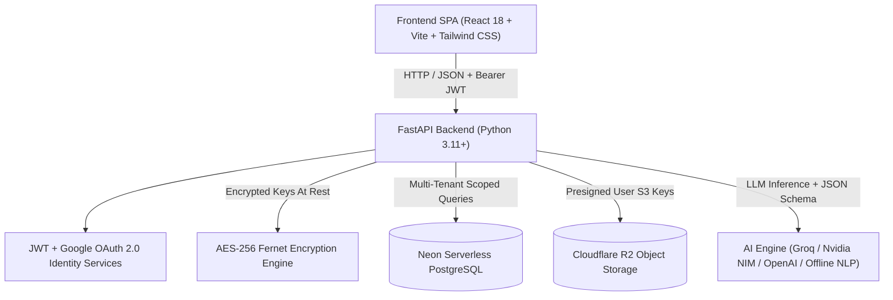
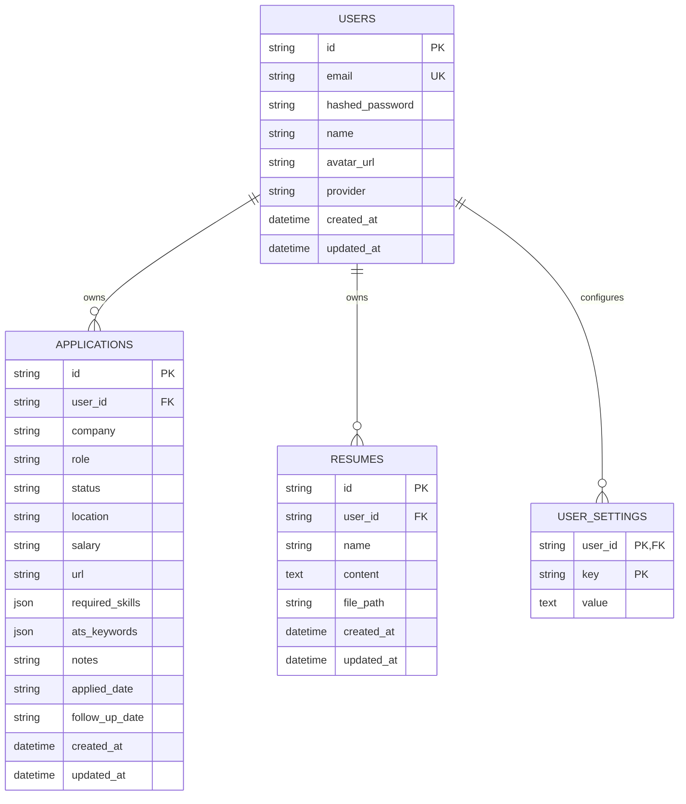
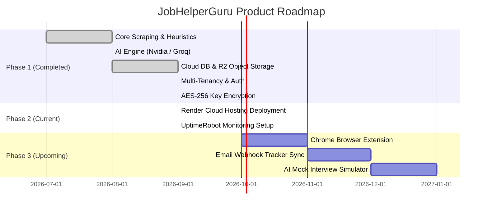

# Product Requirements Document (PRD)

**Product Name:** JobHelperGuru  
**Version:** 1.0.0 (Production Release Candidate)  
**Document Owner:** Sourav Chandhok & Antigravity Engineering  
**Status:** Approved / In Active Development  
**Last Updated:** September 2026  

---

## 1. Executive Summary & Vision

### 1.1 Problem Statement
The modern technical job application landscape is fiercely competitive and automated:
- **ATS Black Holes**: Applicant Tracking Systems (ATS) reject up to 75% of resumes before a recruiter ever reviews them due to mismatched keyword taxonomies and non-standard bullet phrasing.
- **Generic Applications**: Job seekers struggle to tailor multiple versions of their resume and cold outreach pitches across dozens of unique job descriptions, leading to fatigue and poor conversion.
- **Disorganized Pipelines**: Spreadsheets and manual notes lack automated status transitions, deadline calculations, and direct document linkages.
- **Privacy & API Lock-in**: Many commercial tools either store candidate documents insecurely or force expensive proprietary subscriptions rather than allowing users to bring their own high-performance AI keys (e.g., Nvidia NIM, Groq, OpenAI, Ollama).

### 1.2 Product Vision
**JobHelperGuru** is an intelligent, multi-tenant AI job application assistant and lifecycle pipeline tracker. It empowers software engineers, new graduates, and technical professionals to parse job postings from any URL or text, rank their portfolio of resumes for optimal fit, rewrite accomplishment bullets using the proven **XYZ Framework** with verified context-checking, craft high-conversion recruiter outreach pitches, and manage their complete job search pipeline with enterprise-grade cloud isolation and encrypted credentials.

---

## 2. Target Audience & User Personas

| Persona | Description | Key Needs | Pain Points |
| :--- | :--- | :--- | :--- |
| **Alex (New Grad / Student)** | Final-year CS student or recent bootcamp grad applying to entry-level software engineering roles. | Verification of new grad eligibility windows (e.g., 4-month pre-grad or 6-month post-grad), matching coursework and academic projects to required industry tech stacks. | Ineligible rejections due to graduation timing; lack of measurable work metrics. |
| **Jordan (Mid/Senior Engineer)** | Experienced developer seeking higher-tier roles across specialized domains (Backend, Distributed Systems, ML Ops). | Multi-resume ranking to select the best specialized resume for each posting; high-impact metric rewrites (XYZ formula: *Accomplished [X] as measured by [Y], by doing [Z]*). | Spending hours tailoring bullets manually; difficulty articulating quantifiable scale. |
| **Taylor (High-Volume Applicant)** | Active job seeker managing 30-50 applications per week across multiple portals (Greenhouse, Lever, Workday, LinkedIn). | 1-click job scraping from URLs, automated pipeline status progression, Kanban drag-and-drop, and structured Excel reporting. | Tracking fatigue; lost application links; missed follow-up deadlines. |

---

## 3. System Architecture & Tech Stack

### 3.1 Technical Components
- **Frontend SPA**: React 18, Vite 5, Tailwind CSS, Lucide Icons, Glassmorphic UI design system.
- **Backend Service**: FastAPI, Pydantic v2 data models, Uvicorn ASGI server.
- **Database Layer**: Neon Serverless PostgreSQL with connection pooling; automatic SQLite fallback for local offline testing.
- **Object Storage**: Cloudflare R2 (S3-compatible, zero-egress fees) with presigned secure download URLs.
- **AI Integration**: Multi-provider OpenAI-compatible inference client supporting **Groq** (`qwen/qwen3.8-27b`, `llama-3.3-70b`), **Nvidia NIM** (`nemotron-4-340b-instruct`, `meta/llama-3.1-70b-instruct`), **OpenAI** (`gpt-4o-mini`), and **Ollama**, backed by a full **Offline Heuristic NLP Engine** that requires zero API keys.
- **Data Protection**: AES-256 Fernet authenticated symmetric encryption at rest for user API keys and custom model presets.

---

## 4. Core Features & Functional Specifications

### Feature 1: Multi-Format Job Scraping & Structural Analysis
- **URL Scraper**:
  - Automatically fetches and cleans job postings from standard URLs.
  - Native handlers for **Workday CXS REST endpoints**, **SmartRecruiters API**, **Greenhouse / Lever embedded ATS widgets**, **Next.js hydration payloads (Dayforce HCM)**, and **Schema.org `JobPosting` JSON-LD**.
  - Fallback to Trafilatura and BeautifulSoup readable content extraction.
  - Informative guard: If a posting is locked behind authentication (e.g., LinkedIn login wall), the system alerts the user to paste the raw text directly.
- **Text Parsing**:
  - Supports raw copy-pasted job descriptions.
- **Data Extracted**:
  - `title`: Standardized role title.
  - `company`: Employer name.
  - `location` & `work_mode`: Remote, Hybrid, or Onsite.
  - `salary_range`: Extracted compensation patterns (e.g., `$120k - $150k CAD/USD`).
  - `experience_level`: Entry, Mid, Senior, Lead.
  - `is_new_grad_role`: Automatic detection of university/new graduate graduation eligibility windows.
  - `required_skills`, `preferred_skills`, `tech_stack`, `soft_skills`.
  - `ats_keywords`: Curated list of high-priority ATS index terms.

---

### Feature 2: Multi-Resume Fit Ranker
- **Portfolio Evaluation**:
  - Compares all resumes stored in the user's private library against the analyzed job description.
- **Scoring & Match Metrics**:
  - Assigns an ATS fit score (0–100%) based on keyword density, core competency overlap, and required qualifications.
  - Identifies **Matched Keywords** (green pills) and **Missing Keywords** (red pills).
  - Highlights the **"Best Fit Resume"** badge.
- **New Grad Eligibility Audit**:
  - Cross-references graduation dates parsed from candidate resumes against detected job graduation windows (e.g., "Graduating between May 2025 and June 2026").

---

### Feature 3: BulletSkill Optimizer (XYZ Framework)
- **Accomplishment Engineering**:
  - Rewrites weak or generic resume bullet points using the Google **XYZ Formula**:  
    $$\text{"Accomplished [X] as measured by [Y], by doing [Z]"}$$
- **Context-Aware Fact Verification**:
  - Inspects candidate resume evidence before inserting keywords.
  - **Verified Skill**: If the keyword appears in candidate history, weaves it into an existing role bullet with verified metrics.
  - **Unverified Skill**: If absent from candidate experience, does *not* fabricate false claims; instead generates a "Suggested Project" bullet demonstrating how to apply the tool in an open-source or academic project.
- **Multi-Alternative Output**:
  - Generates 3 distinct variations (Impact-Focused, Technical Depth, Scale-Oriented) with an interactive before/after diff view and 1-click clipboard copy.

---

### Feature 4: Tailored Recruiter Outreach Generator
- **Personalized Pitching**:
  - Combines the top-matching resume and the parsed job requirements to draft tailored communication:
    - **Cold Outreach Email**: Compelling subject line, hook, candidate proof points, and polite call to action.
    - **LinkedIn InMail / Connection Request**: Concise message under 300 characters.
    - **Cover Letter Pitch Paragraph**: Ready for applicant portal text boxes.

---

### Feature 5: Multi-View Application Pipeline Tracker
- **Kanban Board & Tabular Views**:
  - Seamless toggle between Kanban board (columns: *Wishlist, Applied, Interviewing, Offer, Rejected*) and sortable data table.
- **Inline Editing & Lifecycle Controls**:
  - Update application status, salary range, interview rounds, and notes directly.
  - Automatic calculation of **Follow-Up Deadlines** (e.g., alert 7 days post-application).
- **Excel Report Exporter**:
  - Generates structured, styled `.xlsx` spreadsheets featuring formatted header ribbons, status color-coding, and skill summaries for offline auditing.

---

### Feature 6: Cloudflare R2 Document Vault
- **Secure File Parsing**:
  - Upload `.pdf`, `.docx`, or `.txt` resumes.
  - Server-side parsing via PyPDF and python-docx.
- **Multi-Tenant Object Storage**:
  - S3-compatible storage keys partitioned per user: `resumes/{user_id}/<uuid>_<filename>`.
  - Time-limited presigned URLs ensure candidate resumes are never publicly accessible to unauthorized third parties.

---

### Feature 7: Multi-Tenant Authentication & Key Security
- **Authentication Methods**:
  - **Google OAuth 2.0**: Native Google Identity Services (GIS) One-Tap and popup sign-in.
  - **Email & Password**: Secure salted hashing via `bcrypt` with minimum 8-character enforcement.
  - **Session Management**: Cryptographically signed stateless JWT Bearer tokens with 7-day expiration.
- **Data Isolation**:
  - Every application, resume, and setting record is constrained by foreign key to `user_id`.
  - Automatic historical record claiming links legacy local data to the primary user upon initial registration.
- **AES-256 Encryption at Rest**:
  - User API keys (Groq, OpenAI, Nvidia) and multi-model configuration arrays (`saved_keys`) are encrypted with AES-128-CBC + HMAC-SHA256 (Fernet) before writing to the database.
  - Decrypted only in memory during inference execution.

---

## 5. Data Model & Database Schema

---

## 6. Non-Functional Requirements (NFRs)

| Category | Requirement | Implementation Standard |
| :--- | :--- | :--- |
| **Performance** | API Response Times | Heuristic parsing $\le 150\text{ms}$; AI analysis $\le 2.5\text{s}$ (via Groq/NIM). |
| **Frontend Speed** | Bundle Size & CWV | Vite production bundle $\le 350\text{kB}$ gzipped; LCP $< 1.2\text{s}$. |
| **Security** | Secret Protection | All user API keys encrypted at rest via AES-256; Zero raw keys in log output. |
| **Data Privacy** | Multi-Tenancy | 100% database query scoping by `user_id`; cross-tenant 404 enforcement. |
| **Availability** | Cloud Uptime | 99.9% uptime with UptimeRobot automated 5-minute health check pinging `/api/health`. |
| **Storage Cost** | Egress Minimization | Cloudflare R2 eliminates AWS S3 egress transfer fees for resume downloads. |

---

## 7. Product Roadmap

### Phase 2: Cloud Deployment (In Progress)
- Deploy unified Docker/ASGI container to Render web services.
- Connect live custom domains and configure UptimeRobot automated 5-minute keep-alive ping.

### Phase 3: Browser Extension & Automation (Q4 2026)
- Chrome Extension (Manifest V3) allowing 1-click job capture directly on LinkedIn, Indeed, and company career portals.
- Automated email parse webhooks to detect interview invites and auto-advance pipeline statuses.

### Phase 4: Interview Preparation Engine (Q1 2027)
- AI-generated mock technical and behavioral questions tailored to matched job description requirements.
